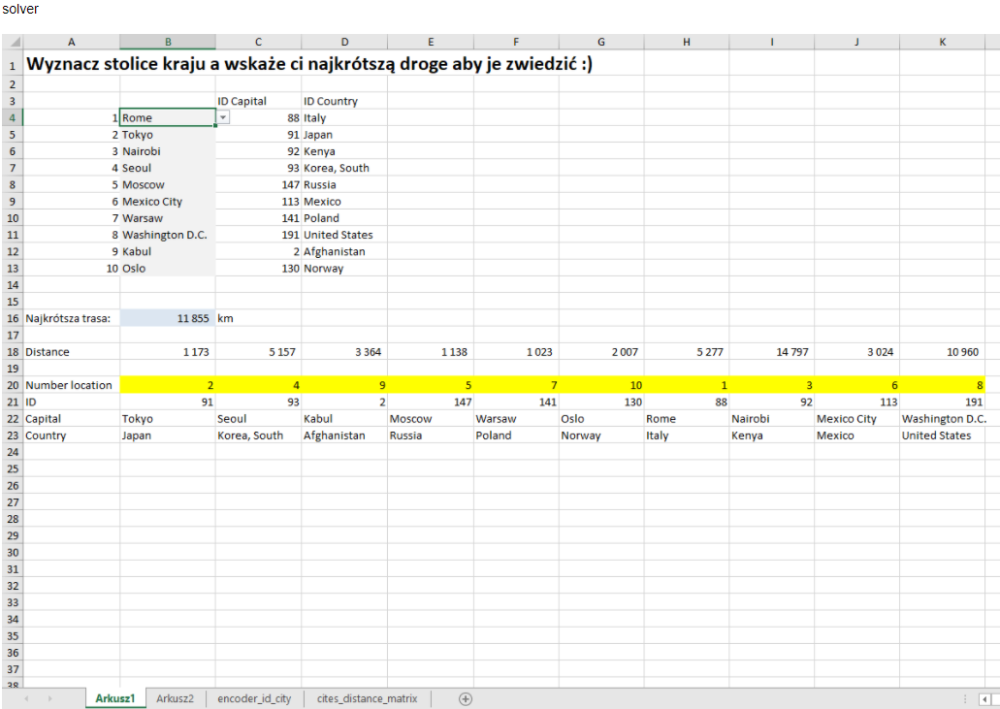
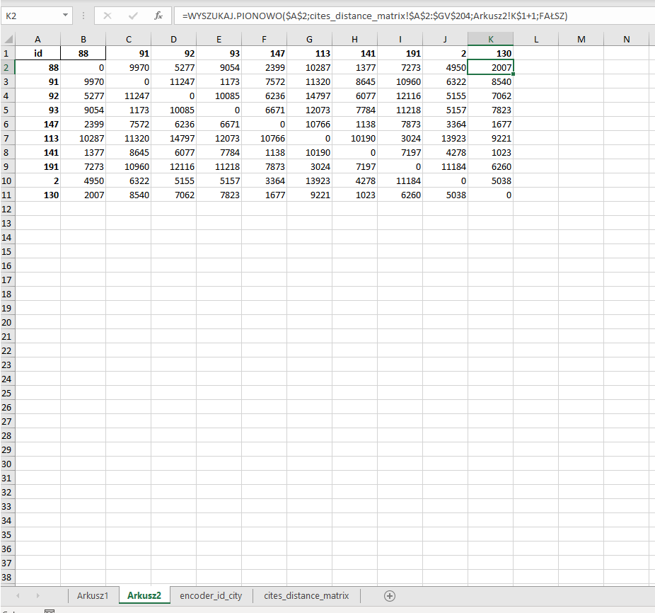
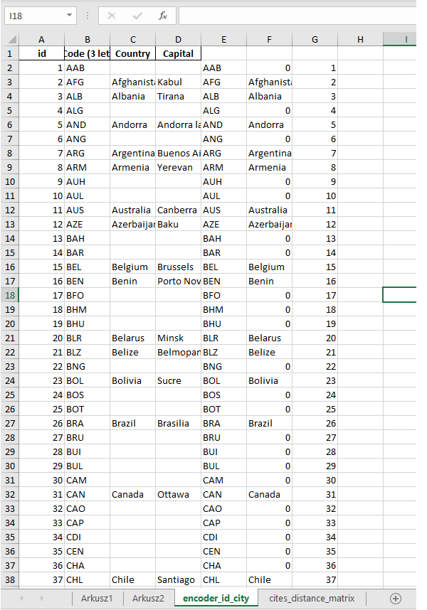
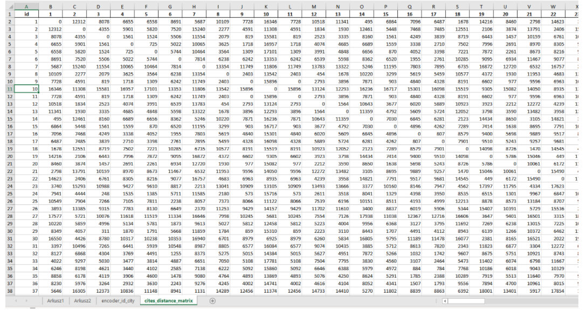
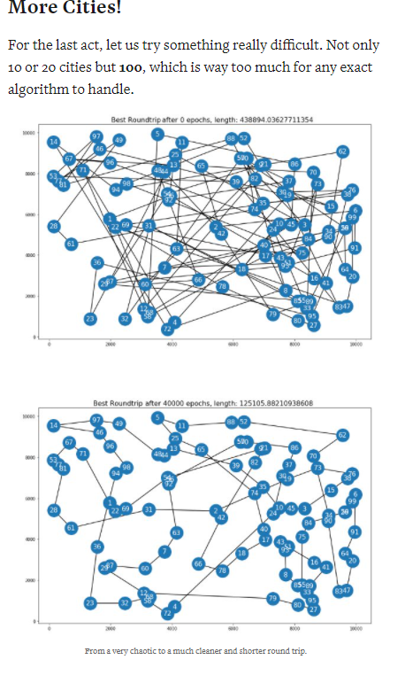

# Optimization_Travelling_Salesman_Problem_-TSP-_distance

etapy i funkcjonalności rozpisane w  zakładce __Projects__

Cel:
https://towardsdatascience.com/an-extensible-evolutionary-algorithm-example-in-python-7372c56a557b

